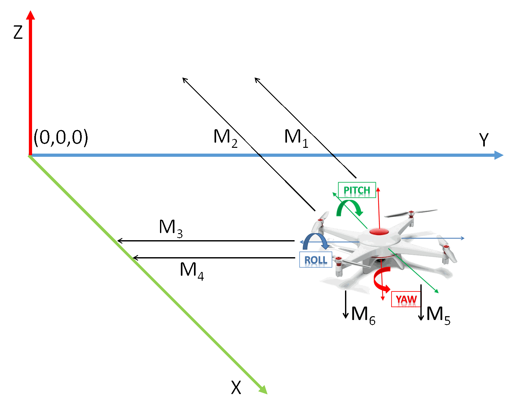

Fixed lasers algorithm
==============

Fixed lasers is one of the numerous localisation system. The main (and only) advantages is to be *relative* to the room, relativly cheap (600$) and in 3D. 

Configurations
-------------------

Configuration files for lasers are under [flyingros_pose/cfg/laser/*](cfg/laser). 

6 lasers configuration example. All configurations must be written in ENU convention. The Pixhawk uses NED as the convention in avionics and mavros converts it to ENU because of the convention of ROS (for more compatibility with other ROS software).



This means: 

* **Positions** are negative if nearer of the wall, and positive if further.
* **Orientations** are positive if pointing the wall in the direction of the X and negative if pointing in the opposite direction. (in our application, it is always negative)
* **Offsets** are positive if the laser measure a too big value and negative if the laser measure a too small value.
* **Yaw indices** are chosen by using the test_node, seeing which configuration give the right measure. Note that you may need to take the opposite of the measure to have the same convetion as ROS (ENU). 

```yaml
lasers:
  count: 6
  positions:
    - [-0.045,  -0.215,  -0.185] # Laser X
    - [-0.060,   0.205,  -0.185] # Laser Z
    - [ 0.150,  -0.250,  -0.020] # Laser A
    - [-0.150,  -0.250,  -0.020] # Laser Y
    - [-0.150,   0.00,   -0.164] # Laser W
    - [ 0.150,   0.00,   -0.164] # Laser B
  orientations:
    - [-1.0,  0.0,   0.0]
    - [-1.0,  0.0,   0.0]
    - [0.0,  -1.0,   0.0]
    - [0.0,  -1.0,   0.0]
    - [0.0,   0.0,  -1.0]
    - [0.0,   0.0,  -1.0]
  offsets:
    - 0.23
    - -0.00 # perfect offset ?
    - 0.08
    - -0.04
    - 0.04
    - 0.09
  # not yet used
  yaw_indices:
    - - lasers : [0,1]
      - indices : [0,1]
      - reverse : False
    - - lasers : [2,3]
      - indices : [1,0]
      - reverse : True
```

Upload the program to the Arduino
------------------

* Compiles flyinros
* Source flyingros (`source devel/setup.bash`)
* Compiles ROSSerial\_Arduino libraries (to have flyingros\_msgs/MultiEcho message) with `rosrun rosserial_arduino make_libraries.py .`
* Copy ros_lib to the Arduino libraries folder (`documents/Arduino/libraries` under Windows)
* Open the Arduino IDE
* Install [LidarEnhanced](https://github.com/AlexisTM/LIDAREnhanced) library (install a .zip library option)
* Upload the script [SixLasersROS](../external/Arduino/SixLasersROS) 

Launch the node
------------------

Create a launch file like `laser_algorithm.launch` which start rosserial and the algorithm :

```xml
<launch>
  <node pkg="rosserial_python" type="serial_node.py" name="rosserial_server" output="screen">
    <param name="port" value="/dev/ttyACM0" />
    <param name="baud" value="115200"/>
  </node>
  <node pkg="rosserial_python" type="message_info_service.py" name="rosserial_message_info" />
  <node name="flyingros" pkg="flyingros_pose" type="six_lasers_algorithm" output="screen" >
    <remap from="/flyingros/lasers/pose2mocap" to="/mavros/vision_pose/pose" />
    <rosparam file="$(find flyingros_pose)/cfg/laser/6lasers.yaml"/>
  </node> 
</launch>
```

Start it with roslaunch

```
roslaunch laser_algorithm.launch
``` 

It will output 3 topics : 

* `/flyingros/lasers/raw` - flyingros_msgs/MultiEcho - Published by the Arduino, gives the measures and the strength of each laser
* `/flyingros/lasers/pose` - PoseStamped - The most recent position
* `/flyingros/lasers/pose2mocap` - PoseStamped - The most recent position with a reduced publish rate

Algorithmics
-------------------

### 2D (altitude) algorithm

Depending on the right Euler convension, the altitude can be independant to the Yaw. By default, we will use the convention `sxyz` of the [transformation.py](http://www.lfd.uci.edu/~gohlke/code/transformations.py.html) library, meaning Static axes, rotation around X, Y then Z. We can use any convention for our computations as we receive a quaternion, which do NOT have any misunderstanding possible. (You can experiment this in [Geogebra](https://www.geogebra.org/))

This means we can compute the altitude without having to *correct* the yaw angle which means nothing when we have no walls. Consider the lasers have an offset on the measure, an offset on the position and an offset on the orientation. 

As we explain in the 3D algorithm, we will simply have the equation `Z=f(Measure, roll, pitch)` to compute the number of times we have lasers. 

The computation itself becomes really simple.

* Rotate the position of the lasers on the multicopter to know its actual position 
* Rotate the orientation of the lasers on the multicopter to know its actual orientation 
* Extrapolate the measure to know what is actually pointed. `target = (measure-offset)*orientation + position`
* The Z coordinate of the target is the distance to the floor

### 3D algorithm


As for the altitude, Z do not depend on the yaw (`sxyz`), X do not depend on the roll (`syzx`) and Y do not depend on the pitch (`sxzy`). The conventions are the same as [transformation.py](http://www.lfd.uci.edu/~gohlke/code/transformations.py.html) library, meaning Static axes, rotation around X, Y then Z. We can use any convention for our computations as we receive a quaternion, which do NOT have any misunderstanding possible.

The algorithm simply changes the problem to a simpler one. Instead of thinking "Where are we in the room?", simply think "How far we are from the wall/floor". Instead of a complex 6 dimension problem `[x,y,z] = f(Measure_x1, Measure_x2, Measure_y, Measure_z, roll, pitch, yaw)` we have a pretty simple 3 dimensional problem. The problem is split into multiple equations;

```
yaw_c1 = f(Measure_x1, Measure_x2, pitch)
yaw_c2 = f(Measure_y1, Measure_y2, roll)
yaw_c = (yaw_c1+yaw_c2)/2
X=f(Measure, pitch, yaw)
Y=f(Measure, roll, yaw)
Z=f(Measure, roll, pitch)
```

The computation is the same as for the altitude, but we have to correct the heading (yaw) before doing the computations 

* Create a quaternion with zero yaw rotation
* Rotate the position of the lasers on the multicopter (X and Y) to know its actual position with null yaw
* Rotate the orientation of the lasers on the multicopter (X and Y) to know its actual orientation with null yaw
* Compute the yaw angle which is function of the difference we measured between the two lasers and their position.
* Create the final quaternion with the computed yaw
* Rotate the position of the lasers on the multicopter to know its actual position with the computed yaw
* Rotate the orientation of the lasers on the multicopter to know its actual orientation with the computed yaw
* Extrapolate the measure to know what is actually pointed. `target = (measure-offset)*orientation + position`
* The X coordinate of the target is the distance to the wall X
* The Y coordinate of the target is the distance to the wall Y
* The Z coordinate of the target is the distance to the floor